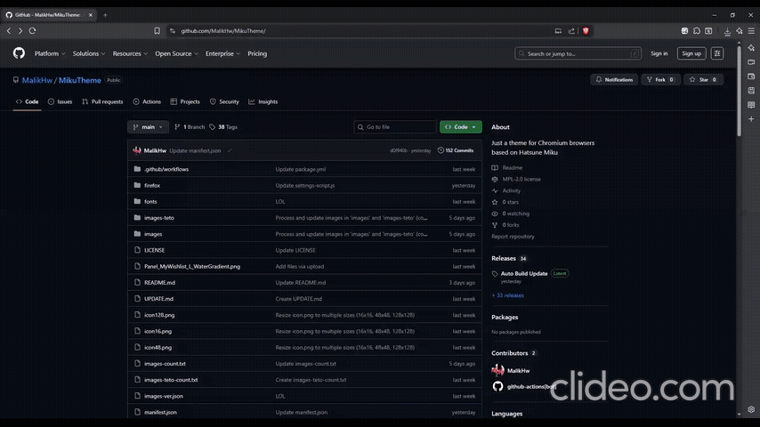

## Miku themed NewTab for chromium browsers
### Screenshots:

how to install:
### MS EDGE: [just go here bub](https://link-target.net/1455259/I6gZjPi5mtrH)
### FIREFOX: [[HYPERLINK BLOCKED]](https://link-target.net/1455259/989wsSmvsm8X)
### OTHER CHROMIUM BROWSERS:
- enable developer options in [here](chrome://extensions)
- download the zip file of chrome
- drag the zip to the extensions Options

### Incase u didnt understand:

## This shi got:
- Automatic updates checker (and tells u how to install)(pls dont manually update when u get this from ms edge store)
- auto new miku updates
- an easter egg apparently
- CUSTOM WALLPAPER/COLOR SCHEME
- idk
- support me here if u want to:

